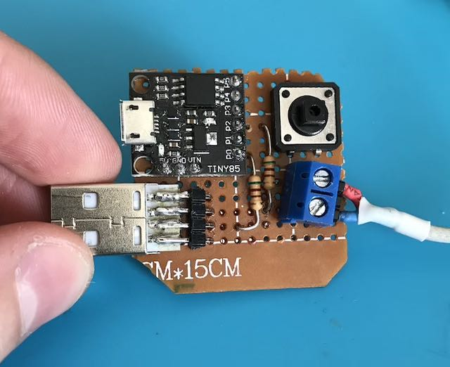
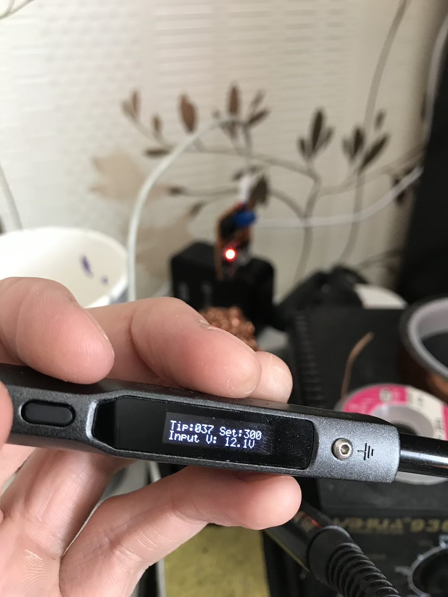

# Digispark-based quick charge trigger

Recently I got a TS100 soldering iron. Since it is quite portable (it is only pencil sized), I was searching for the portable way to power it up. Before, I used some laptop 19V power supply, but it wasn't very handy to carry many power adapters for every kind of mobile equipment I have. So I end up building a small board to control it. 

As a control unit I chose a Digispark – it is quite compact, have a standard 2.54mm pin spacing (so perfboard compatible), and can be easily programmed by connecting it directly to the USB. Here is a trick: you need to get rid of 6 seconds of delay of digispark, but I already have it done – I updated digispark bootloader to only enter programming mode on external reset (connect pin 5 to ground). After enter programming mode you have standard 6 seconds delay to connect the micronucleus programmer software. To do that, change [line 110 of the micronucleus configuration](https://github.com/micronucleus/micronucleus/blob/1f1bf6955c34cb209e9d0d2c1539ec449dbcbfdd/firmware/configuration/t85_default/bootloaderconfig.h#L110) from `ENTRY_ALWAYS` to `ENTRY_EXT_RESET`:

```
#define ENTRYMODE ENTRY_EXT_RESET
```

There is a button to change voltages: cycle between 5, 12, 16, 20, 9, 3.3

### Pictures 

| | | |
|-|-|-|
| Board | Iron |
||  |

## Dependencies ##

* [QC3Control](https://github.com/vdeconinck/QC3Control)

## License ##

MIT